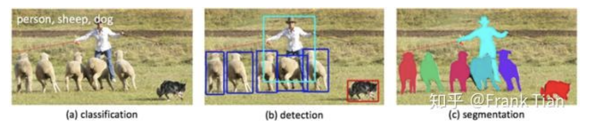
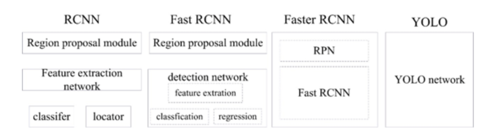
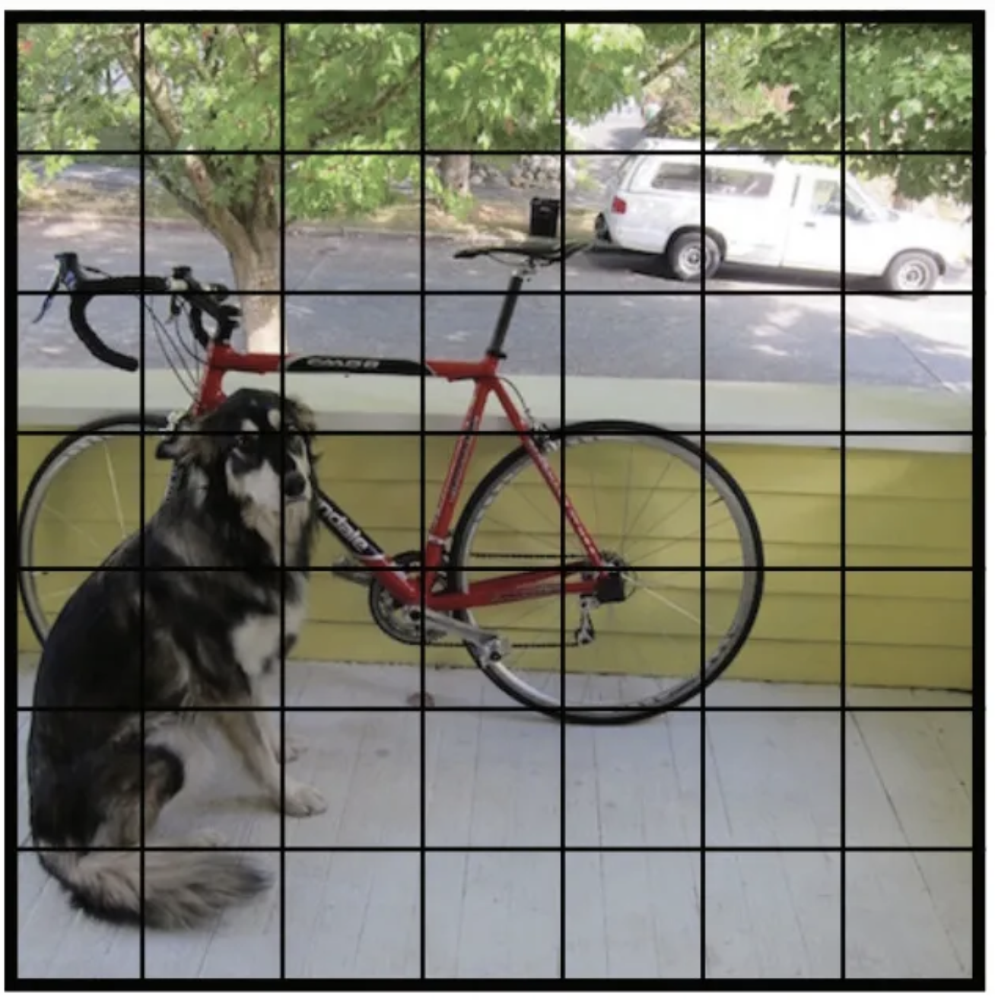

### yolo是什么？
>**YOLO**是目标检测模型

目标检测是计算机视觉中比较简单的任务，用来在一张图片中找到**某些特定的物体**，检测
不仅要求我们识别这些物体的**种类**，同时要求我们标出这些物体的**位置**。

很显然，整体上这三类任务从易到难，我们要讨论的目标检测位于中间。
前面的分类任务是我们做目标检测的基础。

YOLO的全称是you only look once，指只需要浏览一次就可以识别出图中的物体的类别和位置。

因为只需要看一次，YOLO被称为Region-free方法，相比于Region-based方法，YOLO不需要提前找到可能存在目标的Region。

也就是说，一个典型的Region-base方法的流程是这样的：先通过计算机图形学（或者深度学习）的方法，对图片进行分析，找出若干个可能存在物体的区域，将这些区域裁剪下来，放入一个图片分类器中，由分类器分类。

因为YOLO这样的Region-free方法只需要一次扫描，也被称为单阶段（1-stage）模型。Region-based方法方法也被称为两阶段（2-stage）方法。

### YOLO原理

在这之前，我们再重申一下我们的任务。我们的目的是在一张图片中找出物体，并给出它的类别和位置。
目标检测是基于监督学习的，每张图片的监督信息是它所包含的N个物体，每个物体的信息有五个，
分别是物体的中心位置(x,y)和它的高(h)和宽(w)，最后是它的类别。

**YOLO**(You Only Look Once)是继RCNN，
fast-RCNN和faster-RCNN之后，Ross Girshick针对DL目标检测速度问题提出的另一种框架，
其核心思想是生成RoI+目标检测两阶段（two-stage）算法用一套网络的一阶段（one-stage）算法替代，
直接在输出层回归bounding box的位置和所属类别。

之前的物体检测方法首先需要产生大量可能包含待检测物体的先验框, 
然后用分类器判断每个先验框对应的边界框里是否包含待检测物体，以及物体所属类别的概率或者置信度，
同时需要后处理修正边界框，最后基于一些准则过滤掉置信度不高和重叠度较高的边界框，进而得到检测结果。
这种基于先产生候选区再检测的方法虽然有相对较高的检测准确率，但运行速度较慢。

YOLO创造性的将物体检测任务直接当作回归问题（regression problem）来处理，
将候选区和检测两个阶段合二为一。只需一眼就能知道每张图像中有哪些物体以及物体的位置。
下图展示了各物体检测系统的流程图。

YOLO 的预测是基于整个图片的，并且它会一次性输出所有检测到的目标信息，包括类别和位置。

就好像捕鱼一样，R-CNN是先选好哪里可能出现鱼，而YOLO是直接一个大网下去，把所有的鱼都捞出来。

先假设我们处理的图片是一个正方形。

YOLO的第一步是分割图片，它将图片分割为 $ s^2 $ 个grid，每个grid的大小都是相等的，像这样：

